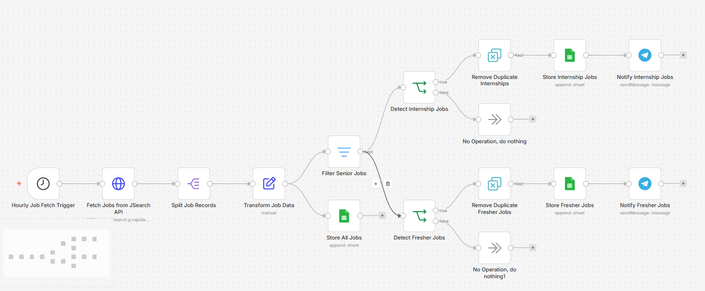
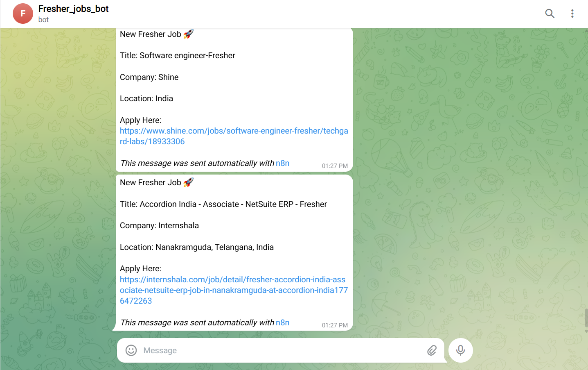
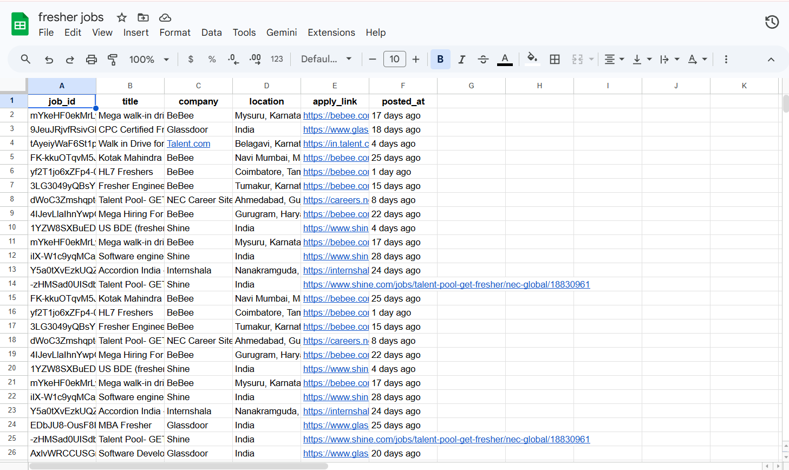

# 🚀 AI-Powered Fresher & Internship Job Alert System


---

# 📌 Project Overview

The **AI-Powered Fresher & Internship Job Alert System** is an automated workflow built using **n8n** that continuously fetches job opportunities from external job APIs, filters relevant fresher and internship roles, removes duplicates, stores structured data, and sends real-time Telegram notifications.

The project was designed to solve a real-world problem where students and freshers often miss opportunities because jobs are scattered across multiple platforms and applications close quickly.

---

# 🚀 Features

✅ Automated job fetching using APIs  
✅ Scheduled workflow execution  
✅ Intelligent filtering of fresher & internship jobs  
✅ Senior job rejection filtering  
✅ Duplicate detection across executions  
✅ Separate internship & fresher job pipelines  
✅ Google Sheets integration for structured storage  
✅ Real-time Telegram notifications  
✅ Event-driven workflow architecture  
✅ Scalable modular workflow design  

---

# 🏗 Workflow Architecture

```text
Schedule Trigger
        ↓
Fetch Jobs from JSearch API
        ↓
Split Job Records
        ↓
Transform / Normalize Job Data
        ↓
Store All Jobs (Google Sheets)
        ↓
Filter Senior / Irrelevant Jobs
        ↓
 ┌─────────────────────┐
 │                     │
 ↓                     ↓
Detect Internship   Detect Fresher Jobs
     ↓                     ↓
Remove Duplicates   Remove Duplicates
     ↓                     ↓
Store Internship    Store Fresher Jobs
     ↓                     ↓
Telegram Alerts     Telegram Alerts
```

---

# 🛠 Tech Stack

| Technology | Purpose |
|---|---|
| n8n | Workflow automation |
| JSearch API | Job data fetching |
| Google Sheets | Structured data storage |
| Telegram Bot API | Real-time notifications |
| Cloudflare Tunnel | Public workflow access |
| HTTP Request Nodes | API communication |

---

# 📸 Workflow Screenshots

## 🔹 Main Workflow



## 🔹 Telegram Job Alerts



## 🔹 Google Sheets Storage




# ⚙️ Setup Instructions

## 1️⃣ Clone Repository

```bash
git clone https://github.com/RaghuRamaRaju7/AI-Powered-Fresher-Internship-Job-Alert-System.git
```

---

## 2️⃣ Import Workflow into n8n

- Open n8n
- Click **Import Workflow**
- Select the exported JSON workflow file

---

## 3️⃣ Configure Credentials

Add credentials for:

- JSearch API
- Google Sheets
- Telegram Bot API

---

## 4️⃣ Configure Telegram Bot

- Create bot using `@BotFather`
- Copy bot token
- Add chat ID in Telegram node

---

## 5️⃣ Configure Google Sheets

Create sheets for:

- All Jobs
- Internship Jobs
- Fresher Jobs

---

## 6️⃣ Activate Workflow

- Enable Schedule Trigger
- Activate workflow
- Workflow automatically runs at configured intervals

---

# 🧠 Key Concepts Used

- Workflow Automation
- API Integration
- Event-Driven Pipelines
- Data Transformation
- Filtering Logic
- Classification Pipelines
- Deduplication
- Real-Time Notifications
- Structured Data Storage

---

# 🚀 Future Improvements

- AI-based job scoring system
- Trusted company filtering
- Career page monitoring
- Personalized job alerts
- Multi-source aggregation
- AI-powered summarization
- Dashboard analytics

---

# 📚 Learning Outcomes

This project helped in understanding:

✅ API orchestration  
✅ Workflow architecture design  
✅ Automation engineering concepts  
✅ Data processing pipelines  
✅ Real-world event-driven systems  
✅ Practical use of n8n for scalable automation  

---

# 👨‍💻 Author

### Raghu Rama Raju Indukuri

- GitHub: https://github.com/RaghuRamaRaju7

---
